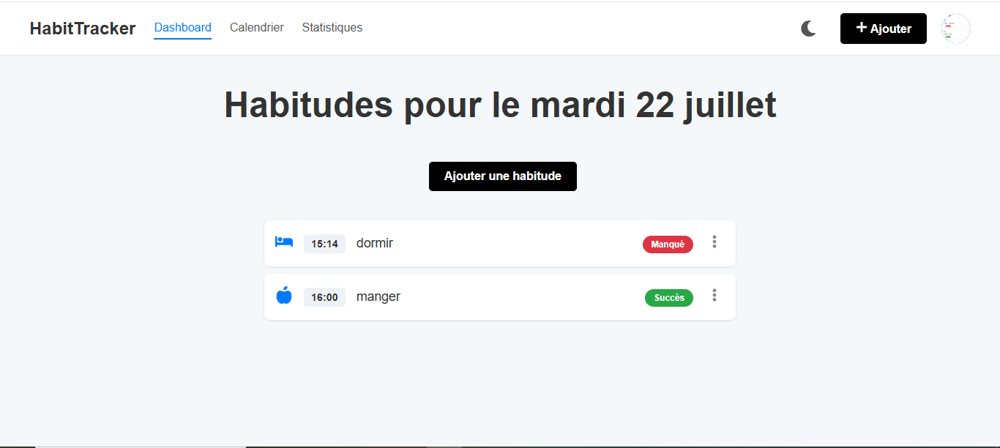
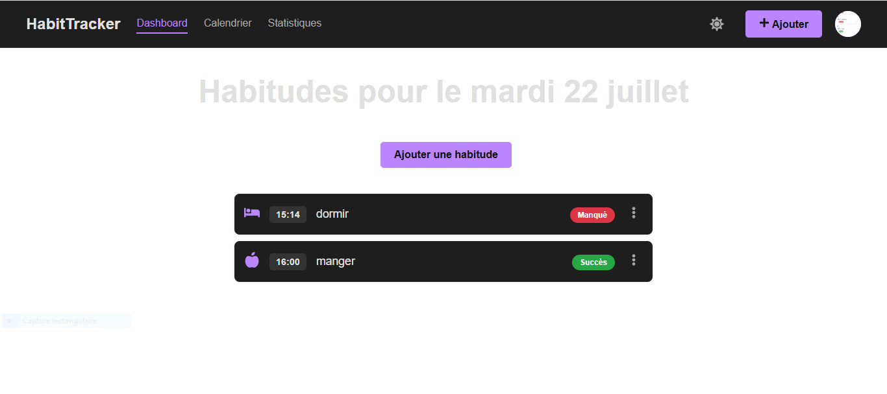
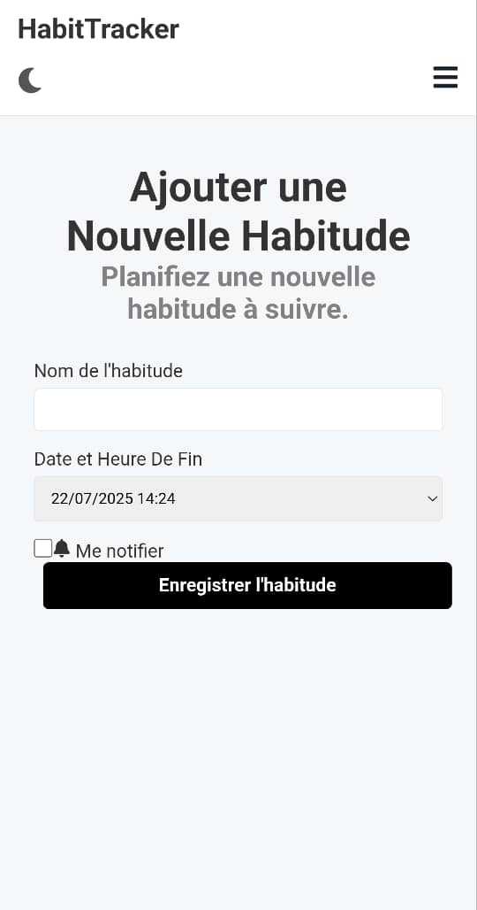
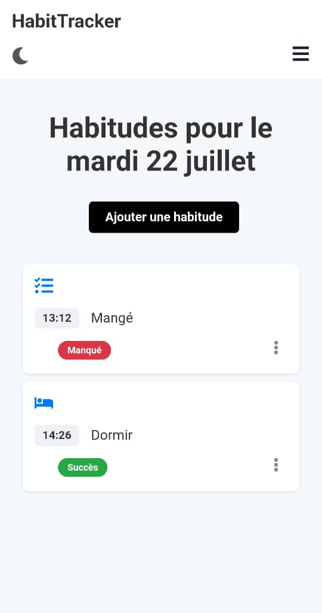

# HabitTracker - Application Web de Suivi d'Habitudes

HabitTracker est une application web full-stack développée avec la stack MERN, conçue pour aider les utilisateurs à construire et suivre leurs habitudes quotidiennes. L'application permet de créer des habitudes avec des échéances précises (date et heure), de suivre leur statut (Accompli, Manqué), et de recevoir des notifications par e-mail pour ne rien oublier. Le projet met un point d'honneur sur une architecture robuste, une gestion correcte des fuseaux horaires, et une expérience utilisateur moderne (Responsive Design, Dark Mode, PWA).

**[Lien vers la Démo en Ligne]** 


## Captures d'écran

 Tableau de Bord (Thème Clair) 
 

Tableau de Bord (Thème Sombre)
 |

Page d'Ajout d'Habitude | Vue Mobile |

 

Tableau de bord | Vue mobile

 |


## Fonctionnalités Principales

-   **Authentification Complète :** Système d'inscription et de connexion sécurisé via JWT, avec hachage des mots de passe (Bcrypt).
-   **Gestion d'Habitudes (CRUD) :** Les utilisateurs peuvent créer des habitudes avec une échéance (date et heure), mettre à jour leur statut, les visualiser et les supprimer.
-   **Logique Temporelle Côté Serveur :** Pour garantir la fiabilité quel que soit le fuseau horaire de l'utilisateur, un job `cron` s'exécute toutes les minutes sur le serveur pour marquer automatiquement les habitudes comme "manquées" si leur échéance est dépassée.
-   **Notifications par E-mail :** Un système automatisé (`nodemailer`) envoie des e-mails pour rappeler une habitude 10 minutes avant son échéance et pour notifier si une habitude a été manquée (fonctionnalité activable par l'utilisateur).
-   **Progressive Web App (PWA) :** L'application est installable sur les appareils mobiles directement depuis le navigateur pour une expérience similaire à une application native.
-   **Interface Moderne et Personnalisable :**
    *   **Responsive Design :** L'interface s'adapte parfaitement aux ordinateurs, tablettes et mobiles.
    *   **Thème Sombre :** Un interrupteur permet de basculer entre un thème clair et un thème sombre.
    *   **Feedback Utilisateur :** Des notifications "toast" informent l'utilisateur du succès ou de l'échec de ses actions.


## Stack Technique

### **Front-end**
-   **React.js** (Hooks) & **Vite**
-   **React Router** pour la navigation et les routes protégées.
-   **React Context** pour la gestion d'état globale (utilisateur, habitudes).
-   **Axios** pour les requêtes à l'API.
-   **React Toastify** pour les notifications.
-   **Vite PWA Plugin** pour la transformation en PWA.

### **Back-end**
-   **Node.js** & **Express.js** pour l'API REST.
-   **MongoDB** avec **Mongoose** pour la modélisation des données.
-   **JWT (JSON Web Tokens)** & **Bcrypt.js** pour la sécurité.
-   **Node-Cron** pour les tâches planifiées (mise à jour des statuts, notifications).
-   **Nodemailer** pour l'envoi d'e-mails.
-   **Express Async Handler** pour une gestion robuste des erreurs asynchrones.
-   **CORS** & **Dotenv**.


## Lancement en Local

### Pré-requis
-   Node.js (v18+)
-   Un compte MongoDB Atlas
-   Un compte Gmail avec un mot de passe d'application

### 1. Cloner le Dépôt
```bash
git clone https://github.com/[Gyres237]/habit-tracker.git
cd habit-tracker
```

### 2. Configurer et Lancer le Back-end
```bash
cd backend
npm install
```
Créez un fichier `.env` à la racine de `/backend` avec le contenu suivant :
```
MONGO_URI=VOTRE_CHAINE_DE_CONNEXION_MONGODB
JWT_SECRET=UN_SECRET_TRES_SOLIDE
EMAIL_USER=VOTRE_ADRESSE_GMAIL
EMAIL_PASS=VOTRE_MOT_DE_PASSE_APPLICATION_GMAIL_16_CARACTERES
```
Lancez le serveur :
```bash
npm run server
```
L'API sera disponible sur `http://localhost:5000`.

### 3. Configurer et Lancer le Front-end
Ouvrez un **nouveau terminal**.
```bash
cd frontend
npm install
npm run dev
```
L'application sera accessible sur `http://localhost:5173`.